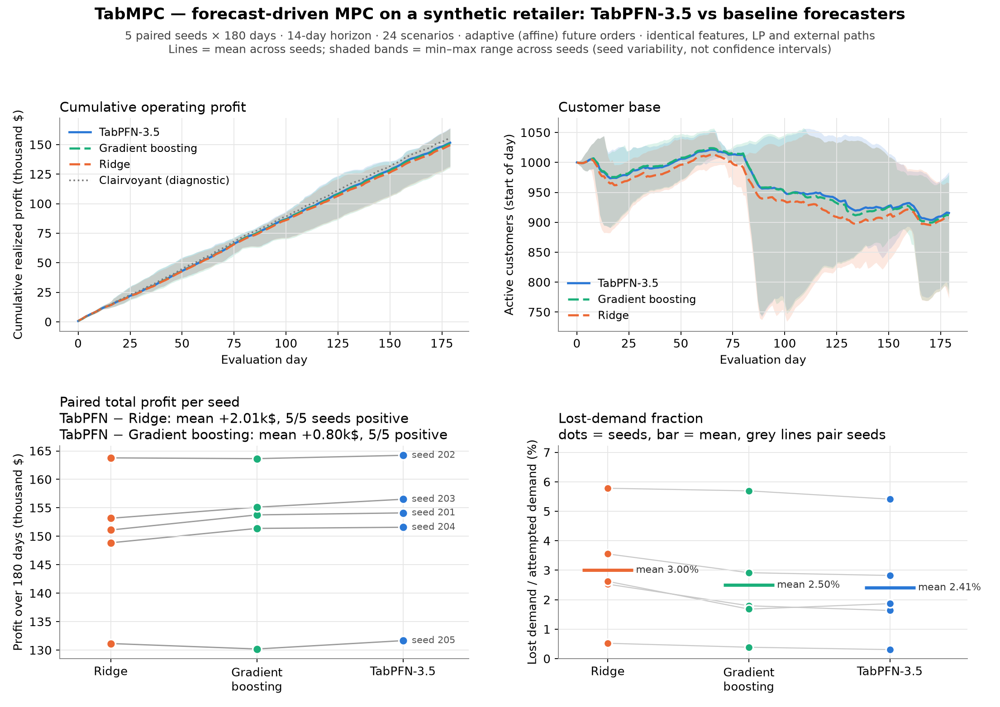
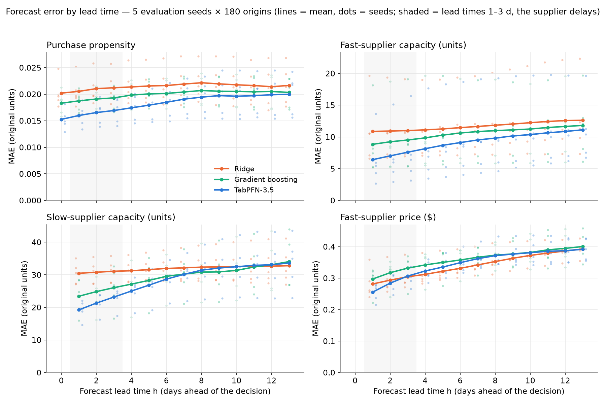

# TabMPC — Model Predictive Control with TabPFN

**TL;DR.** TabMPC uses TabPFN-3.5 as the forecaster inside a model predictive controller.
TabPFN predicts uncertain external conditions, the predictions become future scenarios, a linear
program plans actions across those scenarios, and only today's action is executed before the
controller observes the outcome and replans. On a synthetic retailer with supplier delays and
customers who leave after stockouts, TabPFN was the most accurate short-horizon forecaster for
demand propensity and supplier capacity. The same controller earned modestly more profit with it:
+1.34% over Ridge and +0.53% over gradient boosting, on 5 of 5 paired seeds each.

## Results

Synthetic data; five paired seeds × 180 evaluated days. The external conditions, features, scenarios and
controller (adaptive affine future orders, 14-day horizon, 24 scenarios) are identical across rows;
only the forecaster changes.

| Mean over 5 seeds | Ridge | Gradient boosting | TabPFN-3.5 | Clairvoyant (reference) |
|---|---:|---:|---:|---:|
| Realized operating profit | $149,614 | $150,821 | **$151,620** | $155,627 |
| Lost demand / attempted demand | 3.00% | 2.50% | **2.41%** | 1.97% |
| Final customer base (starts at 1,000) | 907.7 | 912.1 | **915.7** | 928.2 |

* **TabPFN − Ridge:** +$2,006 per seed (+1.34%), positive on 5/5 seeds; nominal paired 95% interval [+$252, +$3,760].
* **TabPFN − gradient boosting:** +$799 (+0.53%), positive on 5/5 seeds; nominal interval [+$62, +$1,536].
* **Caveat:** the intervals come from a small exploratory evaluation and are not established effect sizes.
* **Clairvoyant reference:** the same controller given the true future. It marks what perfect information would add; it is not an attainable target or a proven optimum.



**Forecast accuracy by lead time** (mean absolute error; negative means TabPFN is better):

| Target | 1 day ahead vs Ridge | vs gradient boosting | 3 days ahead vs Ridge | vs gradient boosting |
|---|---:|---:|---:|---:|
| Demand propensity | −22% | −15% | −20% | −12% |
| Fast-supplier capacity | −41% | −27% | −31% | −20% |
| Slow-supplier capacity | −37% | −18% | −25% | −11% |
| Fast-supplier price | −9% | −14% | +1% | −8% |

TabPFN beats both baselines on every seed for propensity and fast capacity at 1–3 days, and for slow capacity
at 1 day. For slow-supplier price and new-customer arrivals it shows no consistent advantage over Ridge.



## How TabPFN is used for MPC

Every simulated day the controller runs one loop:

1. **Forecast.**
   * TabPFN predicts six *external* drivers 14 days ahead: purchase propensity, new-customer arrivals, and each supplier's price and capacity.
   * Inputs are only what is observable at decision time: lags and rolling means, calendar terms, the public event schedule, promotions, a weather forecast, supplier congestion and disruption status.
   * The forecasts are direct multi-horizon: one pooled table with the horizon as a feature, refit weekly on up to 2,000 labelled rows sampled from the last 360 days.
2. **Build scenarios.**
   * Each scenario adds one historical, out-of-sample forecast-error trajectory (all 6 targets × 14 days) to today's forecast. That keeps realistic co-movement across days and variables.
   * All forecasters sample the same historical dates.
   * Today's supplier quotes are known, so they carry no error.
3. **Plan.**
   * A linear program chooses orders to maximize average profit over 24 scenarios, plus conservative terminal values for stock and customers.
   * Today's order is shared by all scenarios.
   * Future orders follow a restricted affine rule, `order = a[day] + b · (that day's capacities, the previous day's propensity)`. This lets them react to information revealed within each scenario, while respecting each scenario's capacity and budget.
4. **Execute and replan.** Only today's order is placed. The simulator then reveals demand, serves it exactly, updates stock and customers, and the loop repeats tomorrow.

The key design choice is to **forecast external conditions, not action-dependent quantities**.
Demand is propensity × customers, and customers depend on past service. So TabPFN forecasts propensity, and
the optimizer keeps customers as a state variable. Within a scenario, propensity is a fixed number, so
`demand = propensity × customers` stays linear, and the whole plan is a sparse LP solved with
SciPy/HiGHS in about 30 ms. TabPFN is the forecaster; the LP does the optimization.

The same pattern fits other resource-allocation problems in which exogenous drivers are uncertain and
decisions have lagged, capacity-limited effects: staffing against arrivals, energy storage against prices
and load, or compute reservations against traffic. This repository implements and evaluates only
the inventory example below.

## The demonstration environment

* **The business:** one product sold at $10.
  * A fast supplier (about $6.50/unit, 1-day lead time, about 110 units/day).
  * A slow supplier (about $5.00/unit, 3-day lead time, about 190 units/day).
  * Limits: a 400-unit store, a $1,450 daily purchasing budget, and holding and disposal costs.
* **Demand** is seasonal and context dependent. Events raise demand mostly in warm weather and on weekends, heat above 27 °C raises it sharply, and promotions matter more in low season.
* **Supply:** supplier congestion is observable and raises the risk and severity of multi-day capacity disruptions. A slow-supplier disruption also pushes up the fast supplier's price.
* **Customer loss:** unmet demand is lost, and it permanently shrinks the customer base.

```
demand[t]      = propensity[t] × customers[t]
sales[t]       = min(demand[t], stock available[t])
lost[t]        = demand[t] − sales[t]
customers[t+1] = 0.98 · customers[t] + arrivals[t] − 0.3 · lost[t]
```

Orders are paid when placed and arrive after their lead time; deliveries that overflow storage are
disposed. External paths are generated once per seed and replayed identically for every forecaster;
customer trajectories then diverge because decisions differ.

## Quick start and reproduction

The installation was tested on macOS (Apple M3, Python 3.12):

```bash
python3.12 -m venv .venv && source .venv/bin/activate
pip install -r requirements.txt        # numpy, pandas, scipy, scikit-learn, matplotlib, tqdm, tabpfn==9.0.0
```

**TabPFN access.** The TabPFN-3.5 weights are released under a non-commercial license. On first use,
`tabpfn` opens a browser to log in at Prior Labs and accept the license, then downloads
`tabpfn-v3.5-20260909.safetensors`. On a headless machine, set `TABPFN_TOKEN` to a token from
https://ux.priorlabs.ai. The model is selected explicitly with
`TabPFNRegressor.create_default_for_version(ModelVersion.V3_5)`, using `n_estimators=4` (the package default is 8) to halve inference time.

```bash
python inventory_mpc.py --selfcheck     # simulator, causality, scenario and LP checks (seconds; no TabPFN)
python inventory_mpc.py --replot-only   # regenerate figures/tables from the committed results (no TabPFN, no inference)
python inventory_mpc.py --quick         # smoke run: 1 seed × 28 days -> results_quick/
python inventory_mpc.py                 # full paired evaluation -> results/
```

**Runtime (Apple M3, 16 GB, MPS).** The original run that computed all forecasts for the full evaluation took
185 minutes. Of that, TabPFN fitting and inference took about 144 minutes, gradient boosting about 15 minutes,
and Ridge under 2 seconds. Forecasts are cached in `results/cache/` (not committed), and a rerun with a warm
cache takes about 1.5 minutes of LP solving. A fresh clone therefore needs the full inference once. A cold
quick run took about 5 minutes. `--device`, `--seeds`, `--models` and the other options are listed by `--help`.

| File in `results/` | Contents |
|---|---|
| `seed_summary.csv` | per seed and model: profit, lost demand, customers, disposal, solver diagnostics, runtime |
| `daily.csv` | full daily trajectories (state, orders, sales, costs, LP status) |
| `forecast_metrics.csv`, `forecast_metrics_by_horizon.csv` | MAE and 80% interval coverage by target, lead time and regime |
| `run_info.json` | configuration, package versions, TabPFN model identifier, paired statistics, and provenance of the original forecast run |
| `comparison.png`, `forecast_horizons.png` | the figures above |

## Scope and limitations

* **Synthetic world.** The environment was designed to contain observable, nonlinear structure, the kind of setting where TabPFN is expected to help. It is not calibrated to, or validated on, any real business.
* **Small, exploratory evaluation.** There are five paired seeds. These seeds were examined during development, including comparisons between earlier controller variants, before the adaptive controller was adopted, so they are not an untouched confirmation set. Baseline hyperparameters and environment settings were fixed on separate development seeds.
* **Uncertainty is approximate.** Scenarios add historical, unconditional error trajectories to point forecasts. This is not TabPFN's native predictive distribution, and conditional quantiles have not been evaluated. Empirical 80% interval coverage ranges from 74% to 84%.
* **Planner simplifications.**
  * Beyond today, planned sales are relaxed to `sales ≤ demand` and `sales ≤ stock` rather than forced to `min(demand, stock)`. Plans therefore withhold about 3% of planned demand on average, while the simulator always serves exactly.
  * The affine order rule is fitted to the same 24 scenarios it plans over, and it is not a full multistage stochastic program.
  * Terminal values are heuristic.
* **Cost.** TabPFN inference dominates the runtime. A GPU or Apple MPS is strongly recommended.
